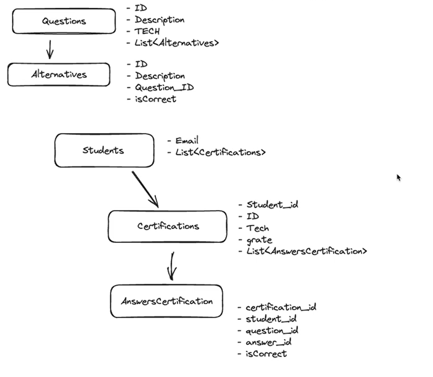

<h1 align="center"><b>Certifications API in Java</b></h1>
<i>With Spring Boot and Apache Maven</i>

<br>
<div align="center">
  
</div>

<h3>👨‍💻 About</h3>

<p>Java application, using Spring as a framework and Maven as a package manager in building a backend with Rest architecture, Clean Code and S.O.L.I.D in a simple Java Certifications API</p>

<h3>Path</h3>
<i>br.com.pratesmath.java-certifications-api</i>
<br><br>
<p>Run application</p>

```sh
mvn spring-boot:run
```

<h3>🚀 Used Libs</h3>

<ul>
  <li><b>Lombok</b>: It is a Java lib that simplifies Spring Boot development, eliminating the need to write boilerplate code, such as getters, setters and constructors, making the code more concise and readable;</li>
  <li><b>H2 (Database Engine)</b>: It is an in-memory database (does not require installation or configuration, and obviously cannot be used in production) that is used for development and testing in Spring Boot projects;
  </li>
    <ul>
      <li>It is a <b>Spring Data JPA</b> project that simplifies interaction with relational databases, allowing CRUD operations in an easier and more efficient way, using the ORM concept. <b>NOTE</b>: uses Hibernate underneath (the most well-known Java ORM);</li>
      <li>An <b>ORM</b> (Object-Relational Mapping) is used to map objects in a software system to tables in a relational database. This facilitates data manipulation and abstracts SQL complexities, making development more efficient and less prone to errors;</li>
    </ul>
</ul>

<p>Integration with H2 Database</p>
Add the following dependencies to the project's <code>pom.xml</code>:

```xml
<dependencies>
  <!-- add the dependencies bellow: -->
</dependencies>
```

Add the following changes to: <code>src/resources/application.properties</code>

```sh
# change default port:
server.port=8085
# database:
spring.datasource.url=jdbc:postgresql://localhost:5434/java_certifications_api
spring.datasource.password=docker
spring.datasource.username=docker
spring.jpa.properties.hibernate.dialect=org.hibernate.dialect.PostgreSQLDialect
spring.jpa.hibernate.ddl-auto=update
spring.jpa.show-sql=true
```

<!-- - Access the following URL: `http://localhost:8080/h2-console` -->

<h3>Notes</h3>
<p>API Rest</p>

<ul>
  <li><b>GET</b>: search a resource</li>
  <li><b>POST</b>: insert a resource</li>
  <li><b>PUT</b>: update a resource</li>
  <li><b>DELETE</b>: remove a resource</li>
  <li><b>PATCH</b>: update a single info in a resource (ex.: change user password)</li>
</ul>

<p>Types of params</p>

<ul>
  <li><b>body</b>: request body (ex.: signup user form)</li>
  <li><b>query params</b>:  these are one or more queries into a request params(ex.: https://site.com/users?name=matheus&age=20, they are optional)</li>
  <li><b>route params</b>: similar to query params, but they're separated by a "/" (ex.: https://site.com/users/{name}/{age})</li>
</ul>

<!-- <h3>Deploy</h3>

The platform chosen to deploy the developed application was [render.com](https://render.com/), as it is a free option and with direct integration with GitHub -->

<br>
<div align="center">
  <h2>Thanks 4 everyone!</h2>
  <p>Made w/ 💙 by <a href="https://github.com/pratesMath">pratesMath</a>.</p>
</div>
